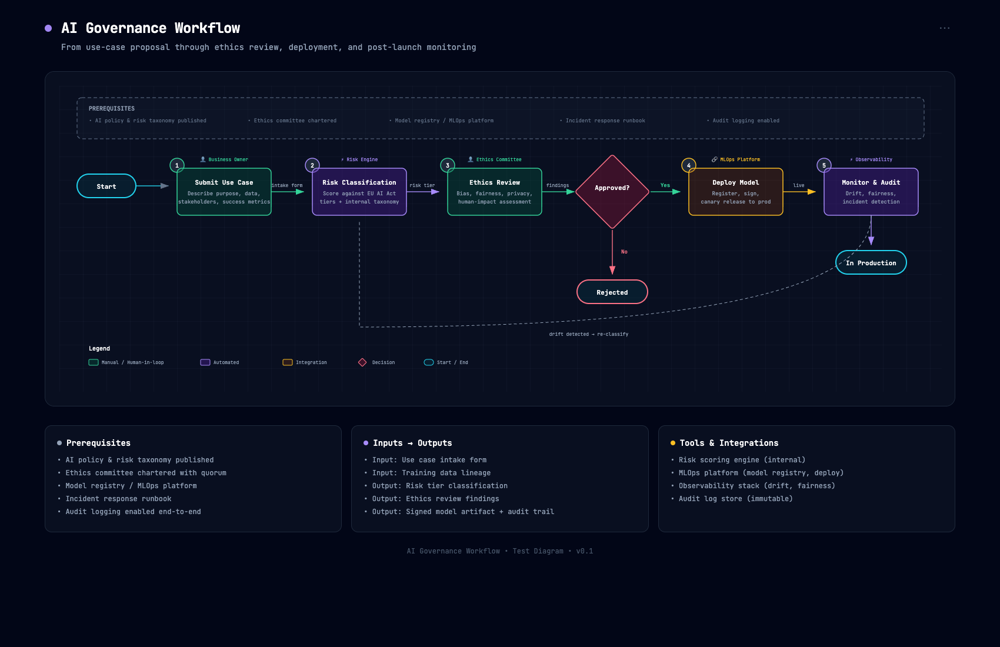
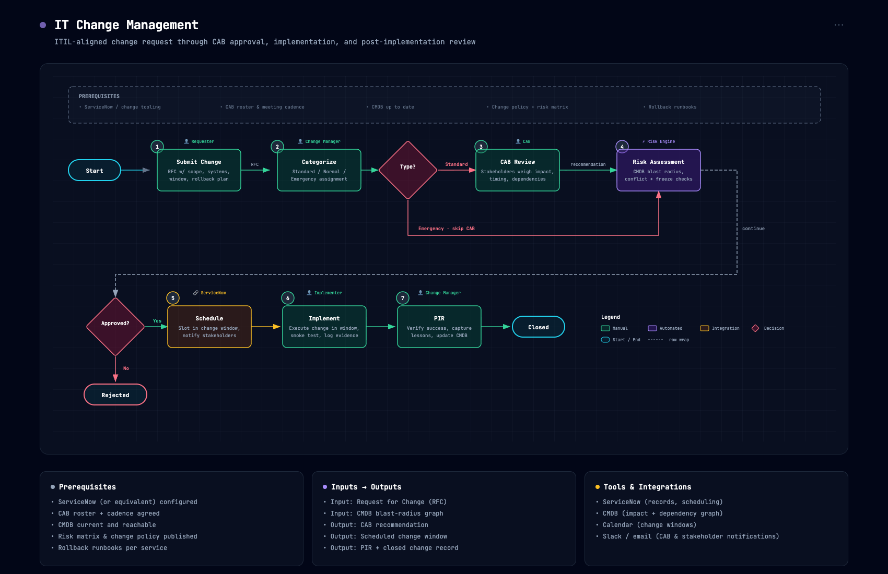
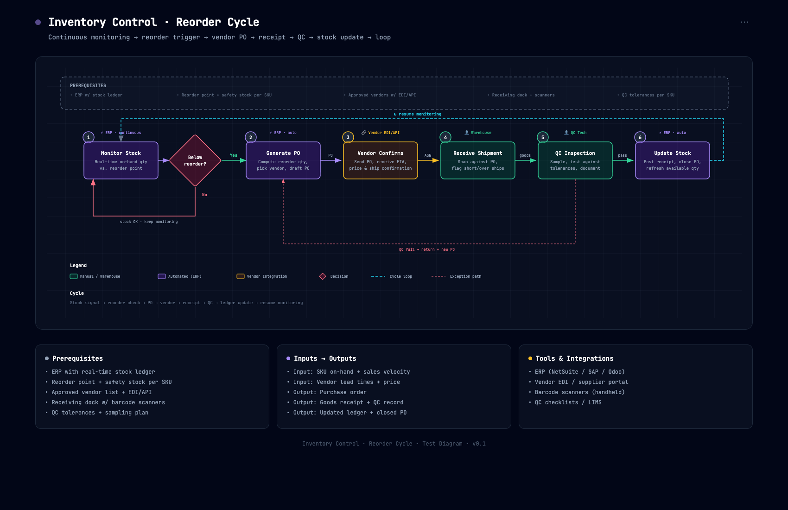
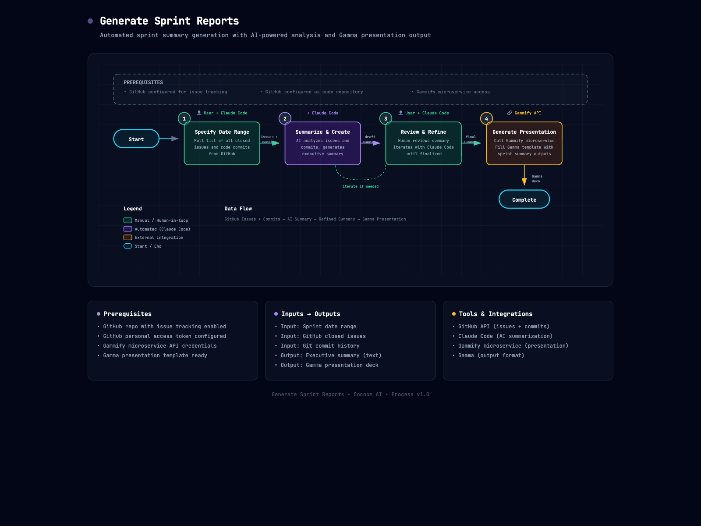

# Process Flow Diagram Generator

**Need a process flow diagram? Get AI to build you one.**

Use [Claude.ai](https://claude.ai) with this special skill to generate professional process flow diagrams in seconds. Describe your workflow — manual steps, automated steps, decisions, integrations — and Claude creates a beautiful, dark-themed diagram as a standalone HTML file you can open in any browser.

- **No design skills needed** — just describe your process in plain English
- **Iterate quickly** — ask Claude to add steps, change paths, or rework decisions
- **Share easily** — output is a single HTML file, no special software required
- **Export built in** — Copy / PNG / PDF buttons baked into every diagram
- **Handles complex flows** — two-row wrap for longer processes, cyclical loop-back for always-on monitoring, exception paths for failure cases


## 🚀 Quick Start (3 Steps)

### Step 1: Install the Skill

> ⚠️ Available on Free, Pro, Max, Team, and Enterprise plans (Code Execution must be enabled in **Settings → Capabilities** first)

1. Download [`process-flow-diagram.zip`](process-flow-diagram.zip)
2. Go to [claude.ai](https://claude.ai) → **Customize** → **Skills**
3. Click the **+** button → **+ Create skill** → **Upload a skill**, then upload the zip file
4. Toggle the skill on

📚 Need help? See the [full installation guide](#-installation) below.

### Step 2: Get Text that Describes Your Process

You just need a text description of your workflow. Pick whichever works for you:

**Option A: Have AI analyze your existing docs**

Open your runbook, SOP, or onboarding doc in Cursor, Claude Code, Windsurf, or ChatGPT and ask:

```
Summarize this process as a numbered sequence of steps. For each step,
note who does it (human or system), what triggers it, what the output is,
and any decision points or branches.
```

**Option B: Write it yourself**

Just list your steps in order:

```
1. User submits expense report
2. System auto-categorizes line items
3. Manager reviews — if total > $500, escalate to finance
4. Finance approves or rejects
5. Approved → Workday creates payment
```

**Option C: Ask for a typical process**

Don't have a specific workflow? Ask Claude for a starting point:

```
What's a typical approval workflow for procurement requests?
```

### Step 3: Generate Your Diagram by Asking Claude to Use the Skill

Take the output from Step 2 and paste it into [Claude](https://claude.ai) (with the Process Flow Diagram Generator skill installed):

```
Use your process flow diagram skill to create a flow diagram from this description:

[PASTE YOUR PROCESS DESCRIPTION HERE]
```

That's it! Claude will generate a beautiful HTML file you can open in any browser.

Then iterate simply by using chat. Ask Claude: *"Add a rejection branch from Step 3"* or *"Change Step 2 to an automated step"* and watch your diagram update. You can also ask Claude to fix any visual issues you spot.

---

### Example Prompts for Common Scenarios

**For an automation pipeline:**

```
Create a process flow diagram for our nightly data sync:
- Trigger: cron at 02:00 UTC
- Pull from Salesforce API
- Transform records (dedupe, normalize)
- Write to Snowflake warehouse
- On failure, page on-call via PagerDuty
```

**For an approval workflow:**

```
Create a process flow diagram for expense approvals:
- Employee submits via Concur
- Auto-classify line items
- Decision: under $500 → auto-approve; over $500 → manager review
- Manager approve/reject → notify employee
- Approved → Workday issues payment
```

**For a development workflow:**

```
Create a process flow diagram for our PR lifecycle:
- Developer opens PR
- CI runs tests + lint
- Decision: pass → request review; fail → notify dev
- Two reviewers approve
- Auto-merge to main
- CD pipeline deploys to staging then prod
```

---

## 📸 Examples

### AI Governance Workflow (5 steps + decision + drift loop-back)



### IT Change Management (ITIL — two-row wrap, 7 steps + 2 decisions)



### Inventory Control (cyclical reorder cycle + QC exception path)



### Sprint Report Generation (automation flow — manual + AI + integration)



## 📤 Export your diagram

Open the HTML file in any modern browser and use the toolbar in the header:

- **📋 Copy** — copy a high-resolution PNG to your clipboard, paste straight into Slides, Docs, or Slack
- **🖼️ PNG** — download a high-resolution PNG file (great for slides and screenshots)
- **📄 PDF** — download a PDF that preserves the dark theme

No install. No command line. Just open the file and click.

## ✨ Features

- **Beautiful dark theme** — Slate-950 background with subtle grid pattern
- **Semantic color coding** — Consistent colors for manual, automated, integration, decision, and start/end steps
- **Step number badges** — Each step gets a clear sequential indicator
- **Decision diamonds** — First-class support for branching workflows
- **Multi-row wrap** — Long processes wrap to a second row with a dashed connector instead of running off the page
- **Cyclical loop-back** — Always-on processes (monitoring, reorder cycles) show their loop visually
- **Exception paths** — Rose dashed arrows for QC fails, rejections, and other off-happy-path branches
- **Self-contained output** — Single HTML file with embedded CSS and inline SVG
- **Works in any browser** — nothing to install, just open the file
- **Professional typography** — JetBrains Mono for that technical aesthetic

## 🎨 Color Palette

| Step Type | Color   | Use For                                      |
| --------- | ------- | -------------------------------------------- |
| Start/End | Cyan    | Process boundaries (begin / complete)        |
| Manual    | Emerald | Human-driven steps (review, input, approval) |
| Automated | Violet  | System-driven steps (compute, transform)     |
| Integration | Amber | API calls, external service hops             |
| Decision  | Rose    | Branch points (approve/reject, yes/no)       |
| Prerequisite | Slate | Setup or context shown above the flow       |

## 📦 Installation

> ⚠️ **Available on:** Free, Pro, Max, Team, and Enterprise plans
>
> **Prerequisite:** Code Execution must be enabled before you can upload a custom skill:
> - Free / Pro / Max — turn on under **Settings → Capabilities**
> - Team / Enterprise — admin enables under **Organization settings → Skills**

> 📚 **New to Claude Skills?** Check out the official guide: [Use Skills in Claude](https://support.claude.com/en/articles/12512180-use-skills-in-claude)

### Claude.ai (Recommended)

1. Download [`process-flow-diagram.zip`](process-flow-diagram.zip)
2. Go to **Customize** → **Skills**
3. Click the **+** button, then **+ Create skill**, then **Upload a skill**
4. Choose the zip file and toggle the skill on

### Claude.ai Projects (Alternative)

1. In your Claude.ai Project, upload the [`process-flow-diagram.zip`](process-flow-diagram.zip) to the Project Knowledge

### Claude Code CLI

Extract to your skills directory:

```bash
# Global skills
unzip process-flow-diagram.zip -d ~/.claude/skills/

# Or project-local
unzip process-flow-diagram.zip -d ./.claude/skills/
```

### Manual Setup

Simply ensure both files are accessible to Claude:

```
process-flow-diagram/
├── SKILL.md              # Skill instructions
└── resources/
    └── template.html     # Base template
```

## 💾 Output

Claude generates a self-contained HTML file that you can:

- Open directly in any browser
- Share with teammates (just send the file!)
- Include in documentation or runbooks
- Print or export to PDF
- Host on any static site

## 📐 What's Included in Output

Each generated diagram includes:

1. **Header** — Process title with animated status indicator and export toolbar
2. **Prerequisites box** — What needs to be in place before the flow starts
3. **Main diagram** — SVG with all steps, decisions, and connections
4. **Summary cards** — 3 info cards (Prerequisites, Inputs/Outputs, Tools)
5. **Footer** — Process metadata

## 🛠 Customization

The skill uses a consistent design system, but Claude will adapt:

- **Layout** — Horizontal or vertical flow based on step count
- **Step types** — Manual, automated, integration, decision, or start/end
- **Branching** — Decision diamonds with labeled paths
- **Annotations** — Arrow labels for inputs, outputs, conditions
- **Loop-backs** — Curved arrows for retry/rework loops

## 📄 Sister skill

For non-sequential system architecture diagrams (components, infrastructure, cloud topology), use [architecture-diagram-generator](https://github.com/Cocoon-AI/architecture-diagram-generator) — same design language, different shape language.

## 🔧 Technical Details

- **SVG viewBox:** Typically 1000-1100px wide, scales responsively
- **Font:** JetBrains Mono (loaded from Google Fonts)
- **Background:** `#020617` with 40px grid pattern
- **Export scripts:** html2canvas@1.4.1, jsPDF@2.5.2 (both pinned with SRI hashes for tamper resistance)

## 📝 License

MIT License — Free to use, modify, and distribute.

## 👥 Contributing

Suggestions and improvements welcome! Feel free to:

- Open an issue for bugs or feature requests
- Submit a PR with enhancements
- Share your generated process flows

## 📬 Contact

**Cocoon AI**
📧 hello@cocoon-ai.com

---

Made with ❤️ by [Cocoon AI](mailto:hello@cocoon-ai.com)
